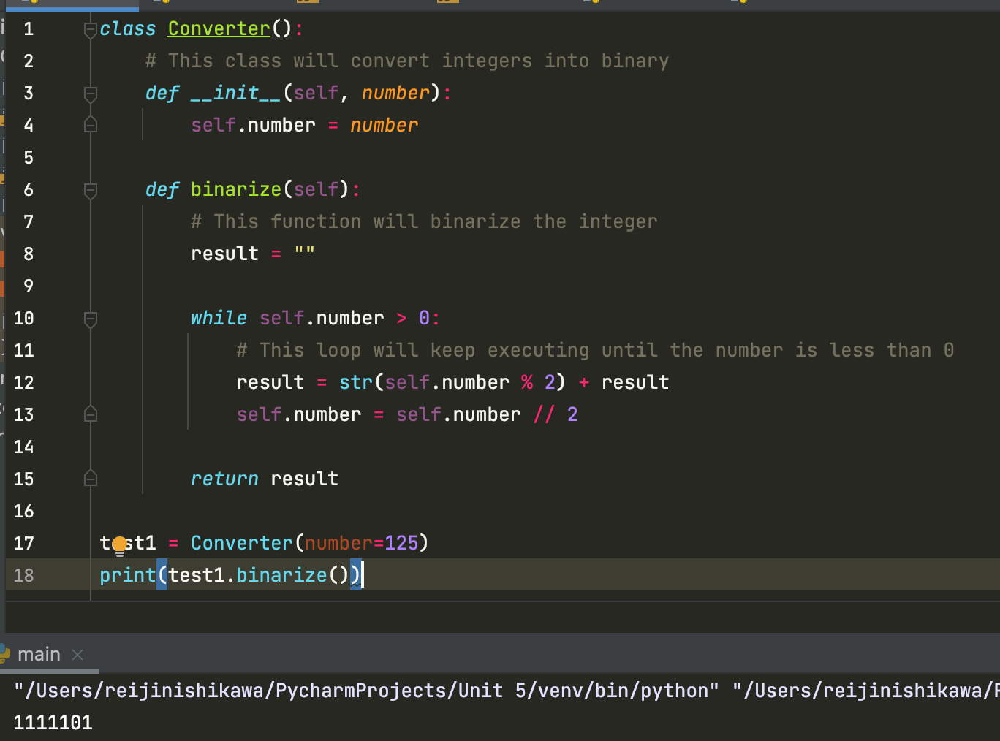

# Binary converter: write a program in OOP that converts a number from 0-255 to a 8-bit binary representation 

## Python Code

```.py
class Converter():
    # This class will convert integers into binary
    def __init__(self, number):
        self.number = number

    def binarize(self):
        # This function will binarize the integer
        result = ""

        while self.number > 0:
            # This loop will keep executing until the number is less than 0
            result = str(self.number % 2) + result
            self.number = self.number // 2

        return result

test1 = Converter(number=125)
print(test1.binarize())
````

## Javascript Code

```.py
class Converter {
    constructor(number) {
        this.number = number
    }
    binarize = () => {
        let result = "";
        while (this.number > 0) {
            result = (this.number % 2) + result;
            this.number = Math.floor(this.number / 2);
        }
        return result;
    }
}

let test1 = new Converter(125);
console.log(test1.binarize());
```

## Output


