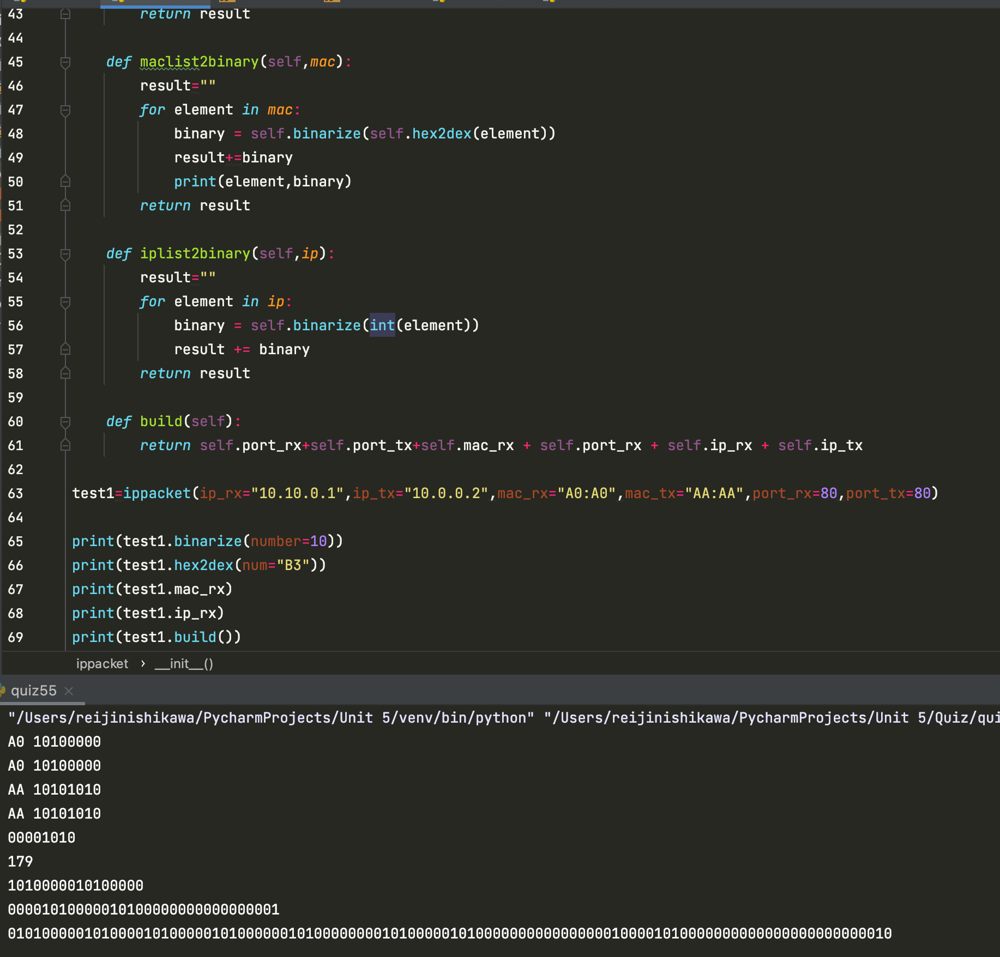

# TCP/IP Packet: write a program in OOP that forms a IP Packet given the IPs, ports, MAC addresses and data 

## Python Code

```.py
class converter:
    def __init__(self, input):
        self.input=input
    def convert(self):

        output=""
        while self.input>0:
            output=str(self.input%2)+output
            self.input=self.input//2
        return output

class ippacket:
    # tx: sender
    # rx: reciever
    # port: 0-2^16 integer
    # mac: BA:AA:09:89:0A:00 string
    # ip: 192.168.0.2 string

    def __init__(self, port_tx:int, port_rx:int, mac_rx:str ,mac_tx:str, ip_rx:str, ip_tx:str):
        self.port_tx = self.binarize(port_tx)
        self.port_rx = self.binarize(port_rx)
        self.mac_rx = self.maclist2binary(mac_rx.split(":"))
        self.mac_tx = self.maclist2binary(mac_tx.split(":"))
        self.ip_rx = self.iplist2binary(ip_rx.split("."))
        self.ip_tx = self.iplist2binary(ip_tx.split("."))

    def binarize(self,number:int):
        result=""
        while number > 0:
            result+=str(number%2)
            number=number//2
        return result[::-1].rjust(8,"0")

    def hex2dex(self,num:str):
        symbols = {"A":10, "B":11, "C":12, "D":13, "E":14, "F":15}
        result = 0
        for index, digit in enumerate(num):
            if digit in "0123456789":
                digit_dec = int(digit)
            else:
                digit_dec = (symbols[digit])
            result += 16**(len(num)-1-index)*digit_dec
        return result

    def maclist2binary(self,mac):
        result=""
        for element in mac:
            binary = self.binarize(self.hex2dex(element))
            result+=binary
            print(element,binary)
        return result

    def iplist2binary(self,ip):
        result=""
        for element in ip:
            binary = self.binarize(int(element))
            result += binary
        return result

    def build(self):
        return self.port_rx+self.port_tx+self.mac_rx + self.port_rx + self.ip_rx + self.ip_tx

test1=ippacket(ip_rx="10.10.0.1",ip_tx="10.0.0.2",mac_rx="A0:A0",mac_tx="AA:AA",port_rx=80,port_tx=80)

print(test1.binarize(number=10))
print(test1.hex2dex(num="B3"))
print(test1.mac_rx)
print(test1.ip_rx)
print(test1.build())
```

## Javascript Code:
```.py
idk bro
```

## Output:

