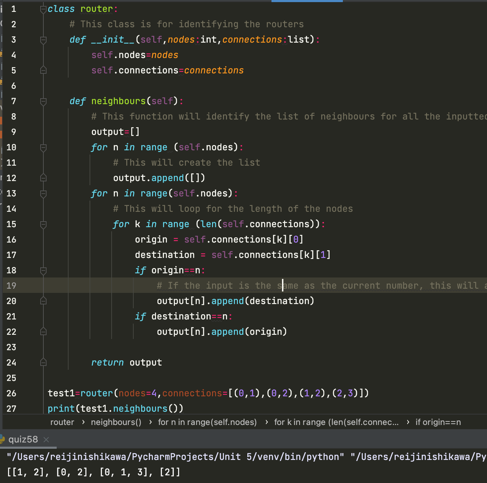

## Python Code

```.py
class router:
    # This class is for identifying the routers
    def __init__(self,nodes:int,connections:list):
        self.nodes=nodes
        self.connections=connections

    def neighbours(self):
        # This function will identify the list of neighbours for all the inputted nodes.
        output=[]
        for n in range (self.nodes):
            # This will create the list
            output.append([])
        for n in range(self.nodes):
            # This will loop for the length of the nodes
            for k in range (len(self.connections)):
                origin = self.connections[k][0]
                destination = self.connections[k][1]
                if origin==n:
                    # If the input is the same as the current number, this will append the following number into the output
                    output[n].append(destination)
                if destination==n:
                    output[n].append(origin)

        return output

test1=router(nodes=4,connections=[(0,1),(0,2),(1,2),(2,3)])
print(test1.neighbours())
```

## Javascript Code

```.py
class router {
  constructor(nodes, connections) {
    this.nodes = nodes;
    this.connections = connections;
  }

  neighbours() {
    var destination, origin, output;
    console.log(this.nodes)
    output = Array(this.nodes).fill([]);

    for (var n = 0, _pj_a = this.nodes; n < _pj_a; n += 1) {
      for (var k = 0, _pj_b = this.connections.length; k < _pj_b; k += 1) {
        origin = this.connections[k][0];
        destination = this.connections[k][1];

        if (origin === n) {
          output[n] = [...output[n], destination];
        }

        if (destination === n) {
          output[n] = [...output[n], origin];
        }
      }
    }

    return output;
  }

}

let test1 = new router(4,[[0, 1], [0, 2], [1, 2], [2, 3]]
);
console.log(test1.neighbours());
```

## Output

