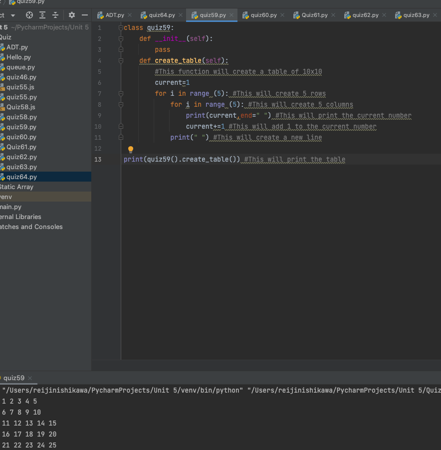

# Time Trial: Create a program that produces the grid below. [HL] Use OOP

```.py
class quiz59:
    def __init__(self):
        pass
    def create_table(self):
        #This function will create a table of 10x10
        current=1
        for i in range (5): #This will create 5 rows
            for i in range (5): #This will create 5 columns
                print(current,end=" ") #This will print the current number
                current+=1 #This will add 1 to the current number
            print(" ") #This will create a new line

print(quiz59().create_table()) #This will print the table
```

## Output:


