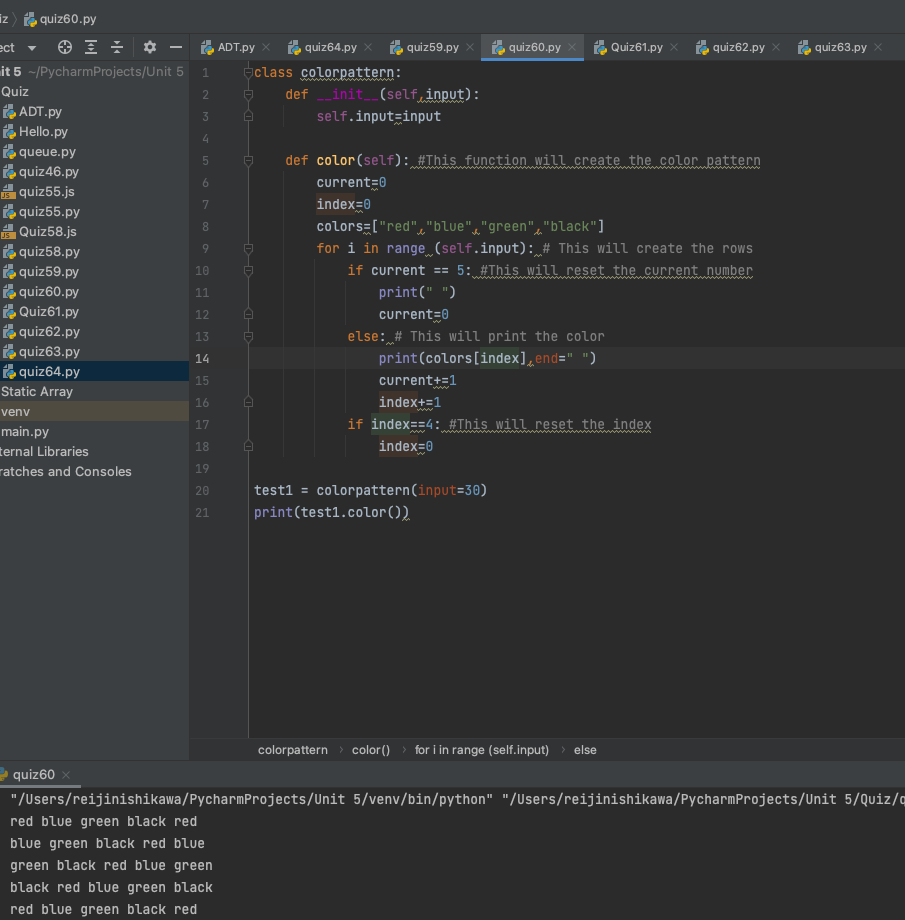

# Time Trial: Create a program that produces the pattern below. [HL] Use OOP

```.py
class colorpattern:
    def __init__(self,input):
        self.input=input

    def color(self): #This function will create the color pattern
        current=0
        index=0
        colors=["red","blue","green","black"] 
        for i in range (self.input): # This will create the rows
            if current == 5: #This will reset the current number
                print(" ")
                current=0
            else: # This will print the color
                print(colors[index],end=" ")
                current+=1
                index+=1
            if index==4: #This will reset the index
                index=0

test1 = colorpattern(input=30)
print(test1.color())
```

# Output:

