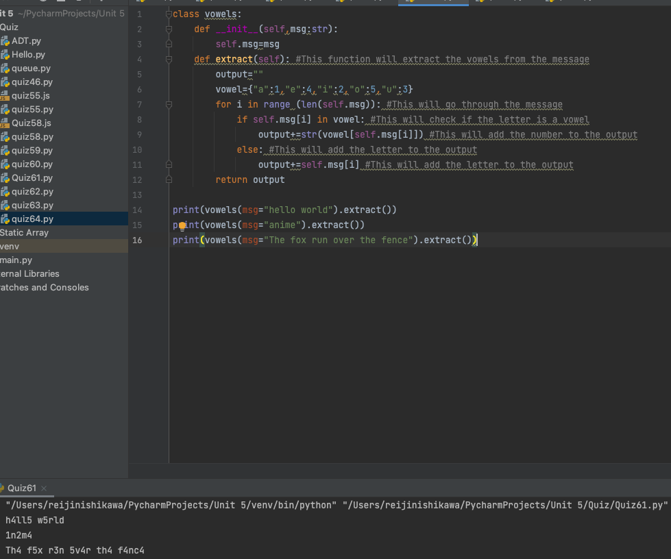

# Time Trial: Extract the vowels from an input message and return the message with the number of the vowels in the order aiueo

## Python Code:
```.py
class vowels:
    def __init__(self,msg:str):
        self.msg=msg
    def extract(self): #This function will extract the vowels from the message
        output=""
        vowel={"a":1,"e":4,"i":2,"o":5,"u":3}
        for i in range (len(self.msg)): #This will go through the message
            if self.msg[i] in vowel: #This will check if the letter is a vowel
                output+=str(vowel[self.msg[i]]) #This will add the number to the output
            else: #This will add the letter to the output
                output+=self.msg[i] #This will add the letter to the output
        return output

print(vowels(msg="hello world").extract())
print(vowels(msg="anime").extract())
print(vowels(msg="The fox run over the fence").extract())
```

## Output:

