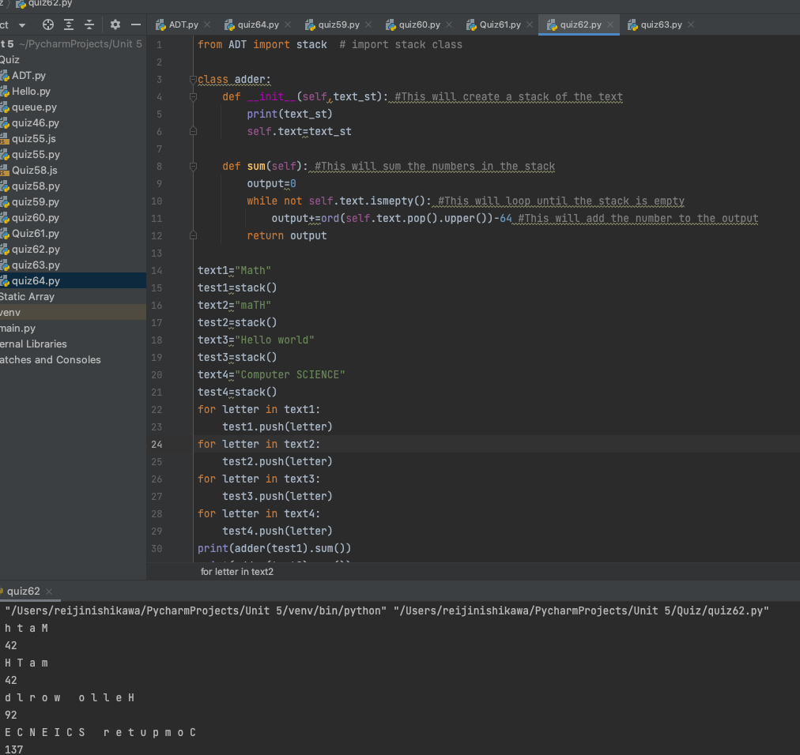

# Time Trial: Given a string, create a program that produces the sum of the characters in the string. Use a stack. 

## Python Code:
```.py
from ADT import stack  # import stack class

class adder:
    def __init__(self,text_st): #This will create a stack of the text
        print(text_st)
        self.text=text_st

    def sum(self): #This will sum the numbers in the stack
        output=0
        while not self.text.ismepty(): #This will loop until the stack is empty
            output+=ord(self.text.pop().upper())-64 #This will add the number to the output
        return output

text1="Math"
test1=stack()
text2="maTH"
test2=stack()
text3="Hello world"
test3=stack()
text4="Computer SCIENCE"
test4=stack()
for letter in text1:
    test1.push(letter)
for letter in text2:
    test2.push(letter)
for letter in text3:
    test3.push(letter)
for letter in text4:
    test4.push(letter)
print(adder(test1).sum())
print(adder(test2).sum())
print(adder(test3).sum())
print(adder(test4).sum())
```

## Output:


