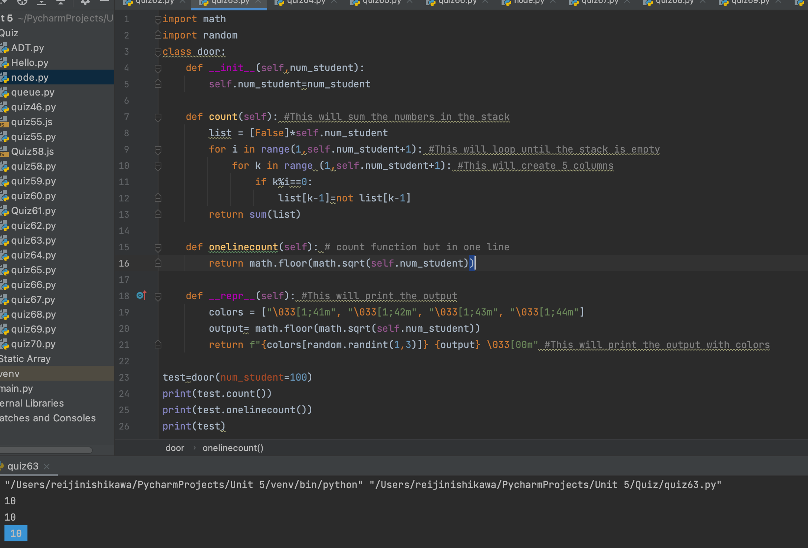

# There are N closed doors in a school and N students present. The first student opens each door. The second student flips (open⇆close) every second door. The third student flips every third door, and so on. 

## Create a class that shows the doors open after N students. And the __repr__ shows the doors open in a colorful message

```.py
import math
import random
class door:
    def __init__(self,num_student):
        self.num_student=num_student

    def count(self): #This will sum the numbers in the stack
        list = [False]*self.num_student
        for i in range(1,self.num_student+1): #This will loop until the stack is empty
            for k in range (1,self.num_student+1): #This will create 5 columns
                if k%i==0:
                    list[k-1]=not list[k-1]
        return sum(list)

    def onelinecount(self): # count function but in one line
        return math.floor(math.sqrt(self.num_student))

    def __repr__(self): #This will print the output
        colors = ["\033[1;41m", "\033[1;42m", "\033[1;43m", "\033[1;44m"]
        output= math.floor(math.sqrt(self.num_student))
        return f"{colors[random.randint(1,3)]} {output} \033[00m" #This will print the output with colors

test=door(num_student=100)
print(test.count())
print(test.onelinecount())
print(test)
```

# Output:

