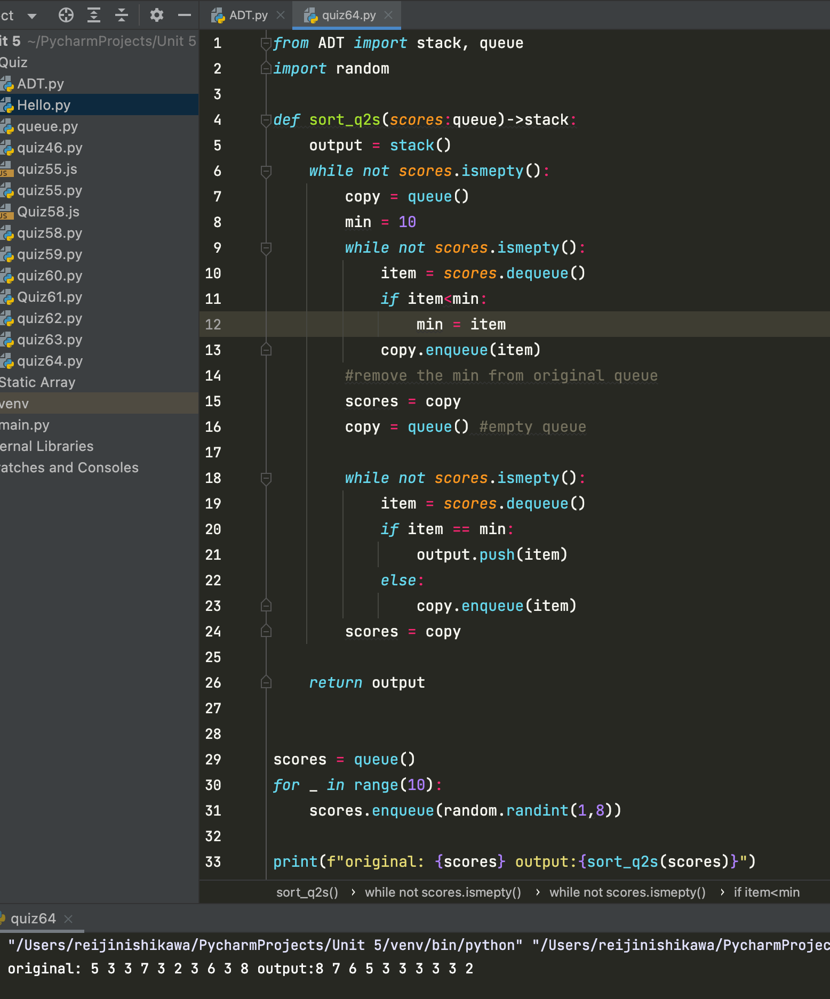
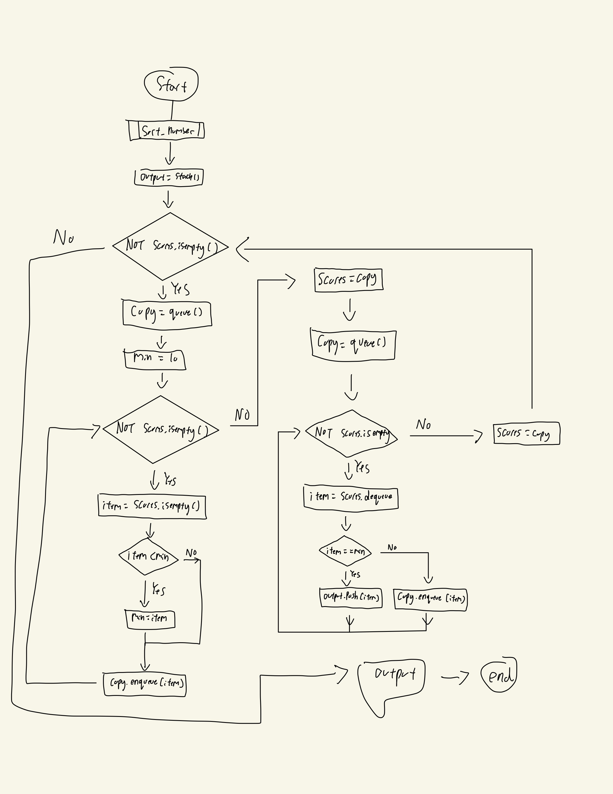

```.py
from ADT import stack, queue
import random

def sort_q2s(scores:queue)->stack:
    output = stack()
    while not scores.ismepty():
        copy = queue()
        min = 10
        while not scores.ismepty():
            item = scores.dequeue()
            if item<min:
                min = item
            copy.enqueue(item)
        #remove the min from original queue
        scores = copy
        copy = queue() #empty queue

        while not scores.ismepty():
            item = scores.dequeue()
            if item == min:
                output.push(item)
            else:
                copy.enqueue(item)
        scores = copy

    return output


scores = queue()
for _ in range(10):
    scores.enqueue(random.randint(1,8))

print(f"original: {scores} output:{sort_q2s(scores)}")
```

## output:


## Flowchart:

