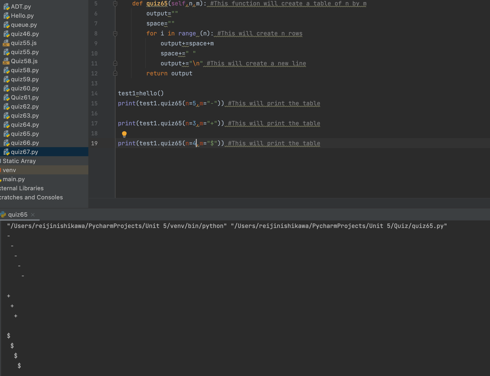

# Reverse mode

## Python Code (OOP):
```
class hello:
    def __init__(self):
        self.self=self

    def quiz65(self,n,m): #This function will create a table of n by m
        output=""
        space=""
        for i in range (n): #This will create n rows
            output+=space+m
            space+=" "
            output+="\n" #This will create a new line
        return output

test1=hello()
print(test1.quiz65(n=5,m="-")) #This will print the table

print(test1.quiz65(n=3,m="+")) #This will print the table

print(test1.quiz65(n=4,m="$")) #This will print the table
```.py

## Output: 


