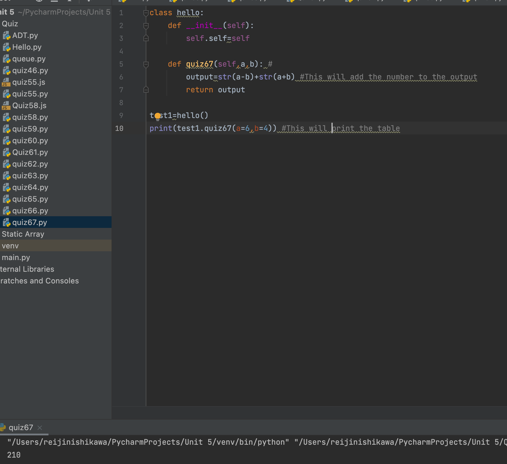

# Create a program that concatenates the results of A-B and A+B

## Python Code (OOP):

```.py
class hello:
    def __init__(self):
        self.self=self

    def quiz67(self,a,b): #
        output=str(a-b)+str(a+b) #This will add the number to the output
        return output

test1=hello()
print(test1.quiz67(a=6,b=4)) #This will print the table
```

## Output:

