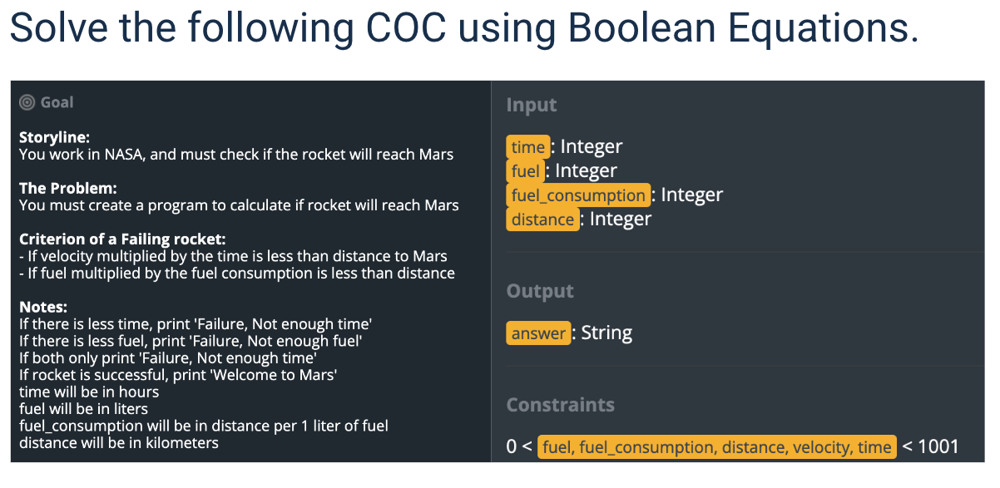
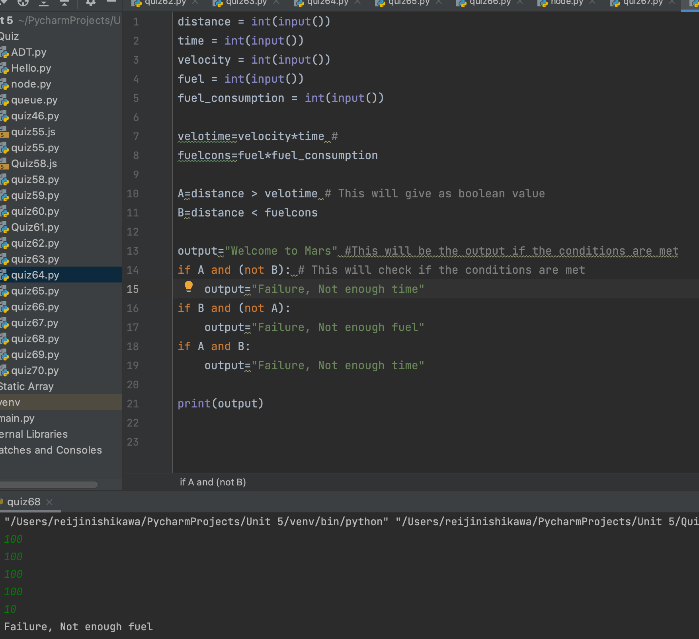

```.py
distance = int(input())
time = int(input())
velocity = int(input())
fuel = int(input())
fuel_consumption = int(input())

velotime=velocity*time #
fuelcons=fuel*fuel_consumption

A=distance > velotime # This will give as boolean value
B=distance < fuelcons

output="Welcome to Mars" #This will be the output if the conditions are met
if A and (not B): # This will check if the conditions are met
    output="Failure, Not enough time"
if B and (not A): 
    output="Failure, Not enough fuel"
if A and B:
    output="Failure, Not enough time"

print(output)
```

# Output:

