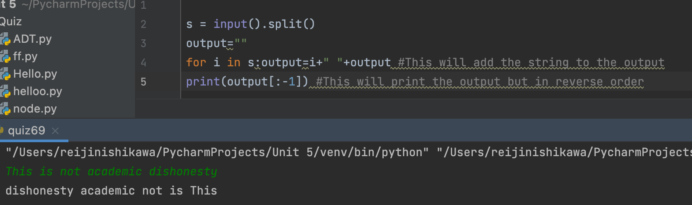

## Python Code:
```.py
s = input().split()
output=""
for i in s:output=i+" "+output #This will add the string to the output
print(output[:-1]) #This will print the output but in reverse order
```

# Output:

