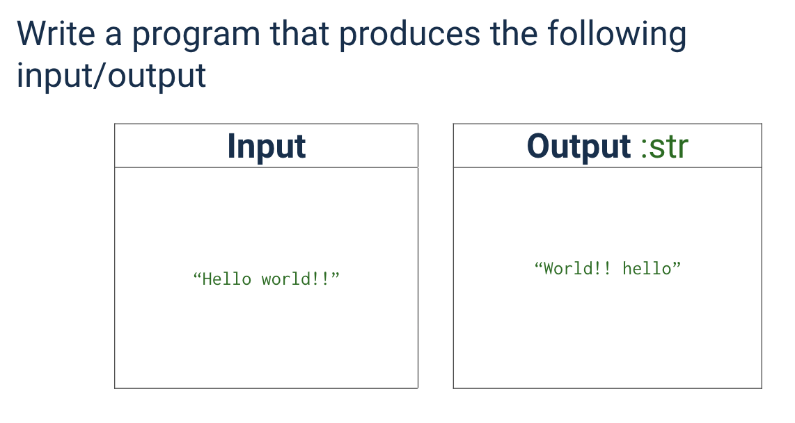

## Python Code:
```.py

s = input().split() 
output=""
for i in s: #This will loop until the stack is empty
    output = i +" "+ output #This will add the number to the output
print(output[:-1] #This will print the table)
```

# Output:

