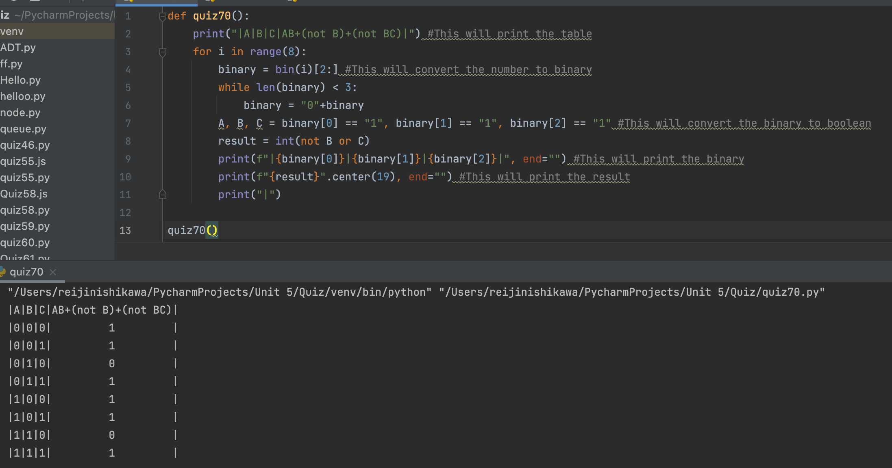

# Using the function that produces the table of Truth for 3 inputs, add a column for the boolean equation
## AB+(not B)+(notB C)

Python Code:

```.py
def quiz70():
    print("|A|B|C|AB+(not B)+(not BC)|") #This will print the table
    for i in range(8):
        binary = bin(i)[2:] #This will convert the number to binary
        while len(binary) < 3:
            binary = "0"+binary
        A, B, C = binary[0] == "1", binary[1] == "1", binary[2] == "1" #This will convert the binary to boolean
        result = int(not B or C)
        print(f"|{binary[0]}|{binary[1]}|{binary[2]}|", end="") #This will print the binary
        print(f"{result}".center(19), end="") #This will print the result
        print("|") 

quiz70()
```

Output:


